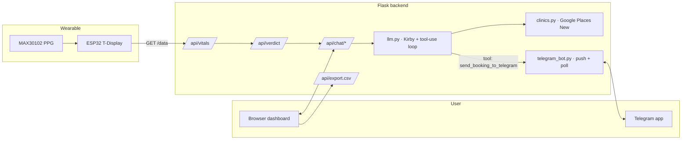

<div align="center">


# Sleep & Cardiac Monitor with Kirby AI Diagnostics

*A wearable, a web dashboard, a Telegram bot, and a warm AI sidekick named Kirby.*

[](https://www.python.org/)
[](https://flask.palletsprojects.com/)
[](https://www.anthropic.com/)
[](https://www.lilygo.cc/)
[](https://core.telegram.org/bots)
[](#license)

</div>

---

## Contents

- [What it is](#-what-it-is)
- [Highlights](#-highlights)
- [Architecture](#%EF%B8%8F-architecture)
- [Quickstart](#-quickstart)
- [Build phases](#-build-phases)
- [The wearable](#-the-wearable)
- [Kirby on the web](#-kirby-on-the-web)
- [Kirby on Telegram](#-kirby-on-telegram)
- [Privacy and limits](#-privacy-and-limits)
- [Acknowledgements](#-acknowledgements)
- [License](#-license)

---

## 🩺 What it is

> [!NOTE]
> Two physiological signals, one virtual pet. The hardware reads SpO<sub>2</sub> and heart rate from your fingertip. The web app charts them live and a warm AI named **Kirby** (Anthropic Claude Haiku 4.5) coaches you when something looks off. A Telegram bot mirrors the same Kirby on your phone, where Singpass mobile auth makes clinic booking painless.

This project extends a **clinically validated** Diploma in Biomedical Engineering capstone (LilyGO TTGO T-Display V1.1 wearable + Flutter app) with a Flask web dashboard, a real-time AI chat surface, and a Telegram-side companion.

> [!IMPORTANT]
> This is **wellness coaching, not medical advice**. Kirby never diagnoses, prescribes, or replaces a clinician.

---

## ✨ Highlights

| | Feature | Why it matters |
|---|---|---|
| 📡 | **Live vitals** at 1 Hz from a wrist-side ESP32 over local Wi-Fi | No cloud round-trip, no data leak |
| 🚦 | **Threshold engine** with debounced anomaly labels (`spo2_low`, `bpm_high`, …) | Fires only on sustained anomalies, not noise |
| 🐾 | **Kirby chat** voiced via Web Speech API + `webkitSpeechRecognition` mic | Hands-free coaching in the moment |
| 🏥 | **Google Places (New)** clinic search via Text + Nearby fallback | "Find clinics in Singapore" works, not just "near me" |
| 📲 | **Telegram booking handoff** with `📍 View on Maps` and `🏥 Visit Clinic Website` | Singpass auth is smooth on mobile, brutal on desktop |
| 💬 | **Bidirectional Telegram bot**: 💓 My Vitals (chart), 🐾 Chat with Kirby, 💡 Help | Same Kirby brain, second surface |
| 📊 | **CSV export** every 30 s — `Timestamp, BPM, SpO2, BPM Level, SpO2 Level` | Bring sessions to your clinician |
| 🎨 | **Glass-morphism dashboard** with animated orb trigger, Kirby + user avatars | Pleasant to live with, day after day |

---

## 🏗️ Architecture



---

## 🚀 Quickstart

> [!TIP]
> The hardware is optional for development. The dashboard runs without it; the status pill just turns red.

```bash
git clone <this-repo>
cd my_health_monitor_project/flask_web_app
python -m venv .venv
source .venv/bin/activate            # PowerShell: .venv\Scripts\Activate.ps1
pip install -r requirements.txt
cp .env.example ../.env              # then edit ../.env
flask --app app run --debug
```

Open <http://localhost:5000>. Click the **Ask Kirby** orb-pill bottom-right to chat.

### Environment variables

| Variable | Required | Purpose |
|---|---|---|
| `ESP32_IP` | for live vitals | Local IP shown on the T-Display splash |
| `ANTHROPIC_API_KEY` | for chat | From [console.anthropic.com](https://console.anthropic.com) |
| `ANTHROPIC_MODEL` | optional | Default `claude-haiku-4-5` |
| `GOOGLE_PLACES_API_KEY` | for clinic search | Enable **Places API (New)** in Google Cloud (legacy "Places API" is a separate product) |
| `TELEGRAM_BOT_TOKEN` | for Telegram | From [@BotFather](https://t.me/BotFather) |
| `TELEGRAM_CHAT_ID` | for Telegram | Your personal chat id from [@userinfobot](https://t.me/userinfobot) |
| `TELEGRAM_POLLING_ENABLED` | for inbound bot | `true` to start the polling daemon. Default off |

> [!CAUTION]
> Run only **one** instance with `TELEGRAM_POLLING_ENABLED=true` per bot token. Telegram delivers each update to a single `getUpdates` caller; a second poller will see HTTP 409 conflicts.

---

## ✅ Build phases

| # | Phase | Status |
|---|---|---|
| 0 | Project skeleton | ✅ |
| 1 | Real-time vitals (`/api/vitals`, Chart.js) | ✅ |
| 2 | Threshold + debounced verdict (`/api/verdict`) | ✅ |
| 3 | Anthropic Haiku + Web Speech I/O | ✅ |
| 4 | Polishing: CSV export, clinic lookup, UI refresh | ✅ |
| 5 | Telegram booking handoff (Claude tool-use) | ✅ |
| 6 | Telegram bot as a second surface | ✅ |
| 7 | Cloud DB, multi-user, ECG, HRV | ⏸ Deferred |

See [`PLAN.md`](PLAN.md) for the full per-phase exit criteria.

---

## 🔌 The wearable

<details>
<summary><b>Hardware bill</b> (click to expand)</summary>

| Component | Part | Role |
|---|---|---|
| MCU | LilyGO TTGO T-Display V1.1 | Dual-core, 1.14" ST7789 TFT, Wi-Fi |
| PPG | MAX30102 | SpO<sub>2</sub> + BPM via IR / Red light (I²C SDA 21, SCL 22) |
| IMU | MPU6050 | 6-axis accel + gyro (movement detection deferred) |
| Power | LiPo + slide switch | Portable |
| Enclosure | 3D-printed black nylon | Blocks ambient light |

</details>

The Arduino sketch (`arduino_sketch/health_monitor/health_monitor.ino`) keeps a finger-detection hysteresis, beat-detection averaging over the last 10 beats, and an EWMA-smoothed SpO<sub>2</sub>. It exposes one local endpoint:

```http
GET http://<ESP_IP>/data
→ { "bpm": 72, "spo2": 97.3 }
```

The on-device TFT shows two cards: BPM (red heart-ECG icon, beat-pulse dot, status strip) and SpO<sub>2</sub> (cyan droplet with `O2` subscript, status strip). Idle and Wi-Fi splash use the same header bar. **All sensor math is locked**; only the display layer was redesigned.

> [!WARNING]
> Clinical validation against a LePu commercial pulse oximeter: SpO<sub>2</sub> deviation ≈ ±2 %, BPM deviation ≈ ±3. Kirby's prompt is constrained never to claim higher precision than the sensor delivers.

---

## 💬 Kirby on the web

The dashboard polls `/api/verdict` at 1 Hz and renders two live Chart.js streams. When an anomaly fires (e.g. SpO<sub>2</sub> ≤ 92 % for 30 s), the chat panel auto-opens and Kirby asks a single, gentle lifestyle question.

The chat panel is glass-morphism with avatar rows, asymmetric bubble corners, and a Lucide-style mic that switches to a red stop-circle while listening. The "Ask Kirby" trigger is an animated conic-gradient orb on a near-white pill.

**Tool-using LLM.** `llm.py` binds an Anthropic-format tool `send_booking_to_telegram(clinic_name, maps_url, website_url)`. Kirby decides when to call it; `_invoke` runs a tool-use round-trip loop (max 5) and feeds the result back as a `ToolMessage`.

---

## 📲 Kirby on Telegram

Open [`@medicalAppointmentBookingBot`](https://t.me/medicalAppointmentBookingBot) and send `/start`. A persistent keyboard appears:

| Button | What it does |
|---|---|
| 💓 **My Vitals** | Pulls the current sample from the ESP32, drops it through the same `RollingBuffer` and `evaluate()` the dashboard uses, then sends a matplotlib chart PNG with a MarkdownV2 caption (BPM + SpO<sub>2</sub> + level labels + 5-min average) |
| 🐾 **Chat with Kirby** | Free-text chat. Kirby answers wellness questions, finds clinics, books appointments. Same brain as the web; chat ids are namespaced as `tg-<telegram_chat_id>` so web and Telegram conversations stay separate |
| 💡 **Help** | Static help with the disclaimer |

The booking flow is identical across surfaces: Kirby's tool call pushes a card with **`📍 View on Maps`** and **`🏥 Visit Clinic Website`** URL buttons. On Telegram, Kirby is also instructed (per-turn) to use 1-3 contextually relevant emojis — the web app stays emoji-free.

---

## 🔒 Privacy and limits

> [!IMPORTANT]
> - **No cloud database.** Vitals and chat live in process memory. A restart wipes them.
> - **No T-Display cloud upload.** The wearable speaks only to your local network.
> - **API keys never enter source.** `.env` is git-ignored; `.env.example` ships placeholders only.
> - **Local Flask only.** No production hosting until a data-handling decision is made.

> [!WARNING]
> Consumer-grade home monitoring. Not a substitute for clinical-grade SpO<sub>2</sub>, ECG, or polysomnography. Every Kirby answer ends with a clinician-referral cue when symptoms persist.

---

## 🙏 Acknowledgements

Original BME capstone:

- **BME team:** Andrea Rudd, Wong Xin Hui
- **CEN collaborators:** Nabil Bin Mohamad Aszami, Muhamad Ikram Bin Dins Esfian, Phang Zhi Hao
- **Supervisor:** Raja Rangaswamy (TP)
- **Industry partner:** Dr. Baey (SleepEasy Clinic)

Flask routing and LLM call style mirror [`zinhmuepaing/Career-Quest-Map`](https://github.com/zinhmuepaing/Career-Quest-Map).

---

## 📄 License

To be added.
